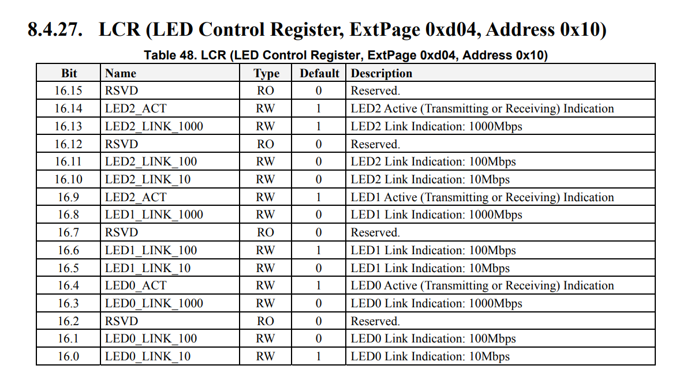

# 软件常见问题

我们精心整理了软件使用中的常见问题及答案，为您提供一个快速查询的支持平台。

## 系统启动配置

此部分主要介绍系统启动相关的问题记录

1. **如何在系统启动时使用指定的 ramfs？**
   在系统启动时使用指定的 ramfs 的步骤如下：

   - **步骤 1： 准备并加载启动文件**
     在 PC 端使用 fastboot 命令将启动所需的文件传输到设备。这些文件包括**内核镜像（vmlinuz）**、**设备树（dtb）** 和 **ramfs镜像（rootfs.cpio.gz）**, 并分别加载如下：
     - 使用 fastboot 命令将内核镜像（vmlinuz）传输到设备
     - 将设备树（dtb）文件传输到设备
     - 传输 ramfs 镜像文件（rootfs.cpio.gz）到设备

     ```javascript
     #pc端的命令行，注意，pc端的命令需要对应到uboot的命令行执行
     fastboot stage vmlinuz-6.6.36
     fastboot stage spacemit/6.6.36/k1-x_FusionOne.dtb
     fastboot stage linux-6.6/rootfs.cpio.gz #该文件可从bsp-src/linux-6.6/里面获取
     ```

   - **步骤 2： 设置 uboot 命令行**
     在 uboot 命令行中，设置内存地址，这些地址将用于加载 **内核、ramfs** 和 **设备树**。
     （**注：** 这里使用的地址是示例，您可能需要根据您的硬件配置进行调整）

     ```c
     #uboot命令行，与上面的pc命令对应，开启fastboot后，pc下发的镜像会存放到指定的内存地址
     fastboot -l 0x20000000 0
     fastboot -l 0x30000000 0
     fastboot -l 0x32000000 0
     ```

   - **步骤 3： 启动指定的 ramfs**
     使用 bootm 命令启动系统，指定内核、ramfs 和设备树的内存地址。这里 `0x12510000` 是 ramfs 镜像文件的大小：

     ```c
     #启动指定的ramfs，0x1251000为rootfs.cpio.gz的大小
     bootm 0x20000000 0x32000000:0x1251000 0x30000000
     ```

   - **步骤 4： 验证启动过程**
     系统启动后，可通过检查系统日志或监控工具来验证 ramfs 是否正确加载并用于系统启动。
     这些步骤将帮助你在系统启动时使用指定的 ramfs，从而快速验证系统启动。请根据具体硬件和软件环境进行适当的调整。

2. **如何修改默认加载的 dtb 方案？**
   在 K1 启动方案中，默认情况下，系统会从 EEPROM 中读取 product\_name，并根据 product\_name 来选择相应的 dtb 文件以匹配硬件配置并启动系统。
   对于需要修改默认加载的 dtb 方案，可以按照以下步骤操作：

   - **步骤 1： 检查 EEPROM**
     确认 EEPROM 中是否已经存储了 product\_name。如果存在，可通过 titanflaser 工具写入 product\_name，具体使用方式可参考文档 [https://developer.spacemit.com/documentation?token=O6wlwlXcoiBZUikVNh2cczhin5d#part521](https://developer.spacemit.com/documentation?token=O6wlwlXcoiBZUikVNh2cczhin5d#part521%E3%80%82)

   - **步骤 2： 修改配置**
     如果没有 EEPROM 或者想要改变默认的 dtb 方案，可通过修改系统配置文件来指定默认的 product\_name。由宏定义 DEFAULT\_PRODUCT\_NAME 指定默认的方案，例如：

     ```c
     //uboot/include/configs/k1-x.h
     #define DEFAULT_PRODUCT_NAME "k1-x_deb1"
     ```

     这样，如果系统启动没有从 eeprom 匹配到合适的 product\_name，或者没有 eeprom，则会指定该默认的启动方案。

   - **步骤 3： 重新编译和部署**
     在修改了配置文件后，重新编译系统以应用更改，并更新设备上的固件。

   - **步骤 4： 测试**
     重启设备，确保新的 dtb 方案被正确加载，并且系统能够正常启动。
     通过这种方式，可根据需要调整系统启动时加载的 dtb 方案，以适应不同的硬件配置或需求。

3. **如何添加开机启动的自定义脚本？**
   添加开机启动的自定义脚本取决于使用的系统类型。以下是两种常见系统的方法：

   - <u>基于 bianbu-linux 系统</u>

     ```javascript
     在/etc/init.d/目录下新建脚本，脚本的执行顺序可以通过脚本文件的命名编号来控制
     ```

     - **步骤 1：** 创建脚本：在 `/etc/init.d/` 目录下新建自定义脚本文件。
     - **步骤 2：** 命名脚本：脚本的执行顺序是通过脚本文件的命名编号来控制。（通常，数字越小，脚本越早执行，如 S50\_testscript）
     - **步骤 3：** 重启系统：重启设备以使更改生效
       （**注：** 确保脚本具有执行权限，执行 chmod a+x /etc/init.d/S50\_testscript）
   - <u>基于 bianbu-minimal 系统</u>

     - **步骤 1：** 创建 /etc/rc.local，编写自定义脚本
     - **步骤 2：** 创建 rc.local：在根目录下创建 `/etc/rc.local` 文件。
     - **步骤 3：** 编写脚本：`/etc/rc.local` 中编写自定义脚本。
     - **步骤 4：** 重启系统：重启设备以使更改生效
       （**注：** 确保脚本具有执行权限，执行 chmod a+x `/etc/rc.local`）

4. **如何实现长按 power 键执行指定的脚本？**
   **背景知识：**
   如以下代码所示：

   - 命令行提供 poweroff 命令关闭系统
   - 通过读取 `/dev/input/event0` 节点，可以获取与输入设备相关的事件

   ```c
   # 命令行关机
   poweroff

   # 通过节点获取按键事件
   cat /dev/input/event0
   ```

   再如以下代码所示：

   - 为解决机械按键的抖动问题，已经对 `spacemit-pwrkey.c` 内核驱动进行修改，通过软件延时策略来消除抖动。（**注：** 该代码改动需要本地修改，不集成到 SDK 中）

   ```c
   diff --git a/drivers/input/misc/spacemit-pwrkey.c b/drivers/input/misc/spacemit-pwrkey.c
   index ab8616dc2c56..48bbf11a7ba7 100644
   --- a/drivers/input/misc/spacemit-pwrkey.c
   +++ b/drivers/input/misc/spacemit-pwrkey.c
   @@ -18,6 +18,9 @@ static int report_event, fall_triggered;
    static struct notifier_block   pm_notify;
    static spinlock_t pm_lock;

   +cycles_t fall_cycle;
   +cycles_t rise_cycle;
   +
    static irqreturn_t pwrkey_fall_irq(int irq, void *_pwr)
    {
           unsigned long flags;
   @@ -25,9 +28,14 @@ static irqreturn_t pwrkey_fall_irq(int irq, void *_pwr)

           spin_lock_irqsave(&pm_lock, flags);
           if (report_event) {
   -               input_report_key(pwr, KEY_POWER, 1);
   -               input_sync(pwr);
   -               fall_triggered = 1;
   +               fall_cycle = get_cycles();
   +
   +               if (fall_cycle - rise_cycle >  150000) {
   +                       input_report_key(pwr, KEY_POWER, 1);
   +                       input_sync(pwr);
   +                       fall_triggered = 1;
   +               }
           }

           pm_stay_awake(pwr->dev.parent);
   @@ -45,6 +53,8 @@ static irqreturn_t pwrkey_rise_irq(int irq, void *_pwr)
           spin_lock_irqsave(&pm_lock, flags);
           /* report key up if key down has been reported */
           if (fall_triggered) {
   +               rise_cycle = get_cycles();
                   input_report_key(pwr, KEY_POWER, 0);

   ```

   实现长按 power 键执行指定脚本的方案可以通过以下<u>两种方法</u>：

   - **方法一：纯 shell 脚本实现**
     通过编写一个 Shell 脚本来监控 power 键的状态。以下是一个示例脚本 `detect_powerkey.sh`，能够检测到长按 power 键的动作并执行相应的操作：
     - **创建检测脚本：** 编写一个 Shell 脚本 `detect_powerkey.sh`，用于检测 power 键的长按事件，赋予可执行权限，chmod a+x `detect_powerkey.sh`。
     - **后台运行：** 使用 `evtest` 命令后台运行并监控 `/dev/input/event0` 设备的按键消息。
     - **计数按压：** 在脚本中，通过读取 `/root/tmp_event_info.txt` 文件来计数 power 键的按压次数。
     - **判断长按：** 如果按压次数超过设定的阈值（例如 30 次，约 3 秒），则认为检测到长按事件。
     - **执行脚本：** 长按后，执行指定的脚本，如 `power_off.sh`。

     ```javascript
     //cat Templates/detect_powerkey.sh
     #!/bin/bash

     #需要后台运行该命令，可以放到脚本外执行，这里先注释掉
     #evtest /dev/input/event0 > /root/tmp_event_info.txt &

     count_num=0
     #detect powerkey press station ready

     echo "" > /root/tmp_event_info.txt

     while true; do 
             echo "xxxxxxxxxxxxxxxxxxxx, press count_num:$count_num"

             if [ $count_num -gt 0 ]; then
                     let count_num+=1
             fi

             if grep -q "value 1" /root/tmp_event_info.txt; then
                     echo "detect powerkey press,"
                     let count_num+=1
             fi

             if grep -q "value 0" /root/tmp_event_info.txt; then
                     echo "detect powerkey release,"
                     count_num=0
             fi

             if [ $count_num -gt 30 ]; then
                     echo "xxxxxxxxxxxxxxxxxxxxxxxx, detect long press 3s"
             fi

             #clear event info
             echo "" > /root/tmp_event_info.txt
             sleep 0.1;
     done
     ```

   - **方法二：C 代码实现**
     在 bianbu-desktop 里面编译（或者使用 bianbu 工具链编译），不支持 bianbu-linux
     - **编写 C 程序：** 创建一个 C 程序 `key_detect.c`，用于检测 power 键的长按事件。

     ```javascript
     //cat key_detect.c

     #include <stdio.h>
     #include <stdlib.h>
     #include <fcntl.h>
     #include <unistd.h>
     #include <linux/input.h>
     #include <errno.h>
     #include <string.h>
     #include <unistd.h>
     #include <sys/time.h>
     #include <time.h>
     #include <gio/gio.h>
     #include <glib.h>

     static void hci_op(gchar *hci_op);

     int main()
     {
             int keys_fd;
             char ret[2];
             struct input_event t;
             struct timeval tv;
             long time_powerkey_press = 0;
             long time_powerkey_up = 0;
             time_t current_time_1, current_time_2;
             time_t current_time = 0;

             int detect_time = 3;

             keys_fd = open("/dev/input/event0", O_RDONLY);
             if (keys_fd <= 0){
                     printf("open /dev/input/event0 fail\n");
                     return 0;
             }
             while(1){
                     if (read (keys_fd, &t, sizeof(t)) == sizeof (t)){
                             if (t.type == EV_KEY){
                                     current_time_1 = time(NULL);
                                     if (t.value == 1){
                                             time_powerkey_press = time(NULL);
                                             if (time_powerkey_press == ((time_t) -1)) {
                                                     printf("can not get currnt time\n");
                                             }
                                     }

                                     current_time_2 = time(NULL);
                                     if (t.value == 0){
                                             time_powerkey_up = time(NULL);
                                             if (time_powerkey_up == ((time_t) -1)) {
                                                     printf("can not get currnt time\n");
                                             }
                                     }

                                     if ((time_powerkey_up - time_powerkey_press) > detect_time && (time_powerkey_up - time_powerkey_press) < 9){
                                             hci_op("hci_start");
                                     }
                             }
                     }
             }
             close(keys_fd);
             return 0;
     }

     static void hci_op(gchar *hci_op)
     {
             GPtrArray *argv = NULL;
             gchar *stdout_str;
             gchar *stderr_str;
             gint estatus;
             GError *error = NULL;

             argv = g_ptr_array_new ();
             g_ptr_array_add (argv, (gpointer)"/usr/bin/power_off.sh");
             g_ptr_array_add (argv, (gpointer)hci_op);
             g_ptr_array_add (argv, NULL);

             g_spawn_sync (NULL, (char**)argv->pdata, NULL, G_SPAWN_DEFAULT, NULL, NULL, &stdout_str, &stderr_str, &estatus, &error);
             g_assert_no_error (error);

             g_print("%s \n", stdout_str);
             g_print("%s \n", stderr_str);

             g_free(stdout_str);
             g_free(stderr_str);
             g_ptr_array_free (argv, TRUE);

             return;
     }

     ```

     - **编译和运行：** 在 bianbu-desktop 环境中编译 C 程序，生成可执行文件 `detect_powerkey.bin` 如下：

     ```javascript
     #在bianbu-desktop编译
     gcc -o detect_powerkey.bin key_detect.c `pkg-config --cflags --libs glib-2.0`

     #可能需要安装依赖，apt install -y libglib2.0-dev
     ```

     - **修改系统配置：** 修改 `/etc/systemd/logind.conf` 文件，忽略 power 键和长按事件。
     - **重启系统：** 应用更改并重启系统。
     - **部署可执行文件：** 将编译好的 `detect_powerkey.bin` 复制到设备上。
     - **创建并授权脚本：** 在设备上创建 `/usr/bin/power_off.sh` 脚本，并设置执行权限。
     - **执行脚本：** 长按 power 键 3 秒后松开，`detect_powerkey.bin` 将执行 `power_off.sh` 脚本。

     ```javascript
     #运行
     sed -i 's/#HandlePowerKey=poweroff/HandlePowerKey=ignore/g' /etc/systemd/logind.conf
     sed -i 's/#HandlePowerKeyLongPress=ignore/HandlePowerKeyLongPress=ignore/g' /etc/systemd/logind.conf
     reboot

     #cp detect_powerkey.bin to device

     touch /usr/bin/power_off.sh
     chmod a+x /usr/bin/power_off.sh

     # 长按powerkey 3s后松开按键，会执行power_off.sh脚本
     ```

5. **如何将 uboot 和 opensbi 镜像文件合并成一个 itb 镜像文件？**
   K1 SDK 默认设计是把 uboot 和 opensbi 分开加载，但开发者也可以根据需求将两者合并。以下是合并 uboot 和 opensbi 的步骤。（请注意标红的内容）

   - **步骤 1： fsbl 启动配置**
     - 在 uboot 配置中取消 second 分区设置，确保取消选中 **"Second partition to use to load U-Boot from"**, 如下图
     - 将分区名更改为 opensbi-uboot 并重新编译 uboot，确保所有相关引用同步更新。
     - （**注：** 分区名为 opensbi-uboot，如需自定义，以下红色字体的 opensbi-uboot 也需要同步修改）
       

   - **步骤 2： 创建 itb 文件**
     创建 `uboot-opensbi.its` 文件，定义 uboot、opensbi 和设备树（dts）的加载参数, 内容如下

     ```shell
     /dts-v1/;

     / {
             description = "U-boot FIT image for k1x";
             #address-cells = <2>;
             fit,fdt-list = "of-list";

             images {
                     uboot {
                             description = "U-Boot";
                             type = "standalone";
                             os = "U-Boot";
                             arch = "riscv";
                             compression = "none";
                             load = <0x0 0x00200000>;
                             data = /incbin/("./u-boot-nodtb.bin");
                     };

                     opensbi {
                             description = "OpenSBI fw_dynamic Firmware";
                             type = "firmware";
                             os = "opensbi";
                             arch = "riscv";
                             compression = "none";
                             load = <0x0 0x0>;
                             entry = <0x0 0x0>;
                             data = /incbin/("./fw_dynamic.bin");
                     };
                     fdt_14 {
                             description = "k1-x_MUSE-Card";
                             type = "flat_dt";
                             compression = "none";
                             data = /incbin/("./uboot/k1-x_MUSE-Card.dtb");
                     };
             };

             configurations {
                     default = "conf_14";
                     conf_14 {
                             description = "k1-x_MUSE-Card";
                             firmware = "opensbi";
                             loadables = "uboot";
                             fdt = "fdt_14";
                     };
             };
     };
     ```

   - **步骤 3： 生成 itb 文件**
     - 将以下文件放在同一目录
       `uboot-opensbi.its`
       `u-boot-nodtb.bin`
       `fw_dynamic.bin`
       `k1-x_MUSE-Card.dtb`（**此为方案设备树，应根据实际方案名修改**）
     - 使用 mkimage 工具生成 `uboot-opensbi.itb` 文件, 如下显示：

       ```shell
       uboot-2022.10/tools/mkimage -f uboot-opensbi.its -r u-boot-opensbi.itb
       ```

   - **步骤 4： 更改分区表**
     以 `partition_universal.json` 为例，删掉 uboot 分区，修改 opensbi 分区名为 opensbi-uboot，分区 size 最好为两者的合集，如下

     ```c
     ~$ cat partition_universal.json 
     {
       "version": "1.0",
       "format": "gpt",
       "partitions": [
         {
           "name": "bootinfo",
           "offset": "0",
           "size": "80B",
           "image": "factory/bootinfo_sd.bin"
         },
         {
           "name": "fsbl",
           "offset": "128K",
           "size": "256K",
           "image": "factory/FSBL.bin"
         },
         {
           "name": "env",
           "offset": "384K",
           "size": "64K"
         },
         {
           "name": "opensbi-uboot",
           "offset": "1M",
           "size": "3M",
           "image": "u-boot-opensbi.itb"
         },
         {
           "name": "bootfs",
           "offset": "4M",
           "size": "256M",
           "image": "bootfs.img",
           "compress": "gzip-5"
         },
         {
           "name": "rootfs",
           "size": "-"
         }
       ]
     }
     ```

   - **步骤 5：更新刷机命令**
     此以 eMMC 为例，将合并后的 uBoot 和 opensbi 镜像文件以及其它系统组件刷入 eMMC 存储器，需要执行以下命令：

     ```bash
     fastboot stage factory/FSBL.bin
     fastboot continue
     #sleep to wait for uboot ready
     #linux环境下
     sleep 1
     #windows环境下
     #timeout /t 1 >null   
     fastboot stage u-boot-opensbi.itb
     fastboot continue

     fastboot flash gpt partition_universal.json
     #bootinfo_emmc.bin内容无作用，请参考3.1.3章节。但刷写步骤还需执行
     fastboot flash bootinfo factory/bootinfo_emmc.bin
     fastboot flash fsbl factory/FSBL.bin
     fastboot flash env env.bin
     fastboot flash opensbi-uboot u-boot-opensbi.itb
     fastboot flash bootfs bootfs.img
     fastboot flash rootfs rootfs.ext4
     ```

     如果使用 spacemit 提供的 titanflasher 工具，需确保刷机包中的 `fastboot.yaml` 文件中将 `u-boot.itb` 的名称更新为 `u-boot-opensbi.itb`。

6. **如何将分区配置成隐藏分区？**
   隐藏分区是一种在分区表中默认不显示的分区，这可以用于存放系统关键文件或配置，避免被用户意外修改或删除。以下是将分区配置为隐藏分区的步骤：

   - **步骤 1：** 编辑分区表配置文件
     - 打开分区表配置文件：使用文本编辑器打开<u>分区表配置文件</u>，如 `partition_universal.json`。
       `cat k1/common/flash_config/partition_universal.json`
     - 设置隐藏属性：对于希望隐藏的分区，添加或修改 `"hidden": true` 属性。这将指示系统在显示分区列表时<u>不包括这些分区</u>。

   - **步骤 2：** 配置隐藏分区
     - 以下是一个包含隐藏分区的分区表配置示例：
       在这个配置中，`bootinfo`、`fsbl` 和 `env` 分区被设置为隐藏，这意味着它们在分区列表中不会显示，从而提供了额外的安全层。

       ```c
       {
         "version": "1.0",
         "format": "gpt",
         "partitions": [
           {
             "name": "bootinfo",
             "hidden": true,
             "offset": "0",
             "size": "80B",
             "image": "factory/bootinfo_sd.bin"
           },
           {
             "name": "fsbl",
             "hidden": true,
             "offset": "128K",
             "size": "256K",
             "image": "factory/FSBL.bin"
           },
           {
             "name": "env",
             "hidden": true,
             "offset": "384K",
             "size": "64K",
             "image": "u-boot-env-default.bin"
           },
           {
             "name": "opensbi",
             "offset": "1M",
             "size": "1M",
             "image": "opensbi.itb"
           },
           {
             "name": "uboot",
             "offset": "2M",
             "size": "2M",
             "image": "u-boot.itb"
           },
           {
             "name": "bootfs",
             "offset": "4M",
             "size": "256M",
             "image": "bootfs.img",
             "compress": "gzip-5"
           },
           {
             "name": "rootfs",
             "size": "-"
           }
         ]
       }
       ```

   - **步骤 3：** 应用更改
     - 保存配置文件：保存分区表配置文件的更改。
     - 重新生成分区表：如果需要，重新生成分区表以应用这些更改。
     - 刷写分区表：将更新后的分区表刷写到存储设备上
       （**注：** 在进行这些操作时，请确保了解每个步骤的后果，并在必要时备份数据。）

## SDK 编译打包

TBD 

## 驱动调试与测试验证

1. **如何确认是否进入 PD 充电模式？**
   要确认设备是否已经进入 PD 充电模式，可检查<u>串口输出的日志信息</u>。如果你的设备已经适配了 PD 充电功能，当插入 PD 适配器后，如果串口打印出以下或类似的信息，则表明设备已经成功进入 PD 充电模式：

   ```javascript
   [57876.061510] husb239 4-0042: husb239_attach status: a1 status1: 0
   [57876.070579] husb239 4-0042: update sink voltage: 5000000 current: 500000
   [57876.292256] husb239 4-0042: pd detect 
   [57876.543622] husb239 4-0042: update sink voltage: 9000000 current: 3000000
   ```

   (**注：** 请确保设备驱动程序和固件支持 PD 充电，并且使用的是兼容的 PD 适配器。)

2. **如何在 dts 中打开 i2c？**
   要在设备树（dts）中启用 i2c 接口，需要<u>对 dts 文件进行配置</u>，以确保 i2c 控制器被正确初始化并可用。以下是以 i2c5 为例的配置步骤：

   - uboot 配置：
     - **步骤 1：** 启用 I2C 控制器：在 uboot 的 dts 文件中，找到 i2c5 控制器的节点，并确保其 `status` 属性设置为 `"okay"`。
     - **步骤 2：** 配置引脚控制：为 i2c5 控制器指定引脚控制设置，这通常涉及到定义 `pinctrl-names` 和 `pinctrl-0` 属性。
     - **步骤 3：** 添加 I2C 设备：如果需要，可以添加连接到 i2c5 的设备节点，并为它们设置适当的 `reg` 属性和 `status` 属性。
       示例配置如下：

     ```c
     diff --git a/arch/riscv/dts/k1-x_FusionOne.dts b/arch/riscv/dts/k1-x_FusionOne.dts
     index 6b1e594d3d..a254a45000 100644
     --- a/arch/riscv/dts/k1-x_FusionOne.dts
     +++ b/arch/riscv/dts/k1-x_FusionOne.dts
     @@ -60,6 +60,19 @@
             status = "okay";
      };

     +&i2c5 {
     +       #address-cells = <1>;
     +       #size-cells = <0>;
     +       pinctrl-names = "default";
     +       pinctrl-0 = <&pinctrl_i2c5_1>;
     +       status = "okay";
     +
     +       charge@53{
     +               reg = <0x53>;
     +               status = "okay";
     +       };
     +};
     ```

   - Linux 配置：
     - **步骤 1：** 启用 I2C 控制器：在 Linux 内核的 dts 文件中，确保 i2c5 控制器的 `status` 属性设置为 `"okay"`。
     - **步骤 2：** 配置引脚控制和时钟频率：为 i2c5 控制器指定引脚控制设置，并设置 `clock-frequency` 属性以定义 I2C 时钟频率。
       示例配置如下：

     ```c
     diff --git a/arch/riscv/boot/dts/spacemit/k1-x_FusionOne.dts b/arch/riscv/boot/dts/spacemit/k1-x_FusionOne.dts
     index e077ddc2b..d2d38668c 100644
     --- a/arch/riscv/boot/dts/spacemit/k1-x_FusionOne.dts
     +++ b/arch/riscv/boot/dts/spacemit/k1-x_FusionOne.dts
     @@ -256,6 +244,14 @@ &i2c4 {
             status = "okay";
      };

     +&i2c5 {
     +       pinctrl-names = "default";
     +       pinctrl-0 = <&pinctrl_i2c5_1>;
     +
     +       clock-frequency = <400000>;
     +       status = "okay";
     +};
     ```

   通过这些配置，可在 uboot 和 Linux 内核中启用 i2c5 接口，使其可用于设备通信。

3. **如何通过命令行读写 i2c 设备？**
   通过命令行与 i2c 设备进行交互，可以使用 uboot 或 linux 内核提供的工具来读写 i2c 设备。以下是具体步骤：

   - **在 uboot 中读写 i2c 设备：**
     - **选择 I2C 总线：** 选择要通信的 I2C 总线，如示例，设备连接在 I2C 总线 `2` 上。
     - **设置默认频率：** 设置 I2C 通信的频率，如示例，默认为 `100kHz`。
     - **读取 I2C 设备：** 使用 `i2c md` 命令从指定的 I2C 设备地址读取数据。如示例，从地址 `0x53` 读取一个字节
     - **写入 I2C 设备：** 使用 `i2c mw` 命令向指定的 I2C 设备地址写入数据。如示例，向地址 `0x53` 的寄存器 `1` 写入数据 `0x11`
       示例如下：

     ```javascript
     => i2c bus
     Bus 0:  twsi2@d4012000  (active 0)
     [   8.578]    50: eeprom@50, offset len 1, flags 0
     [   8.582] Bus 1:       twsi4@d4012800
     [   8.585] Bus 2:       twsi5@d4013800
     [   8.588] Bus 3:       twsi8@d401d800  (active 3)
     [   8.592]    41: pmic@41, offset len 1, flags 0
     => [   9.632] i2c dev 2
     Setting bus to 2
     [  16.449] Default to 100kHz
     => [  23.146] i2c md 0x53 1 1
     0001: 10    .
     => i2c mw 0x53 1 0x11
     => i2c mw 0x53 1 0x10 
     ```

   - **在 Linux 内核(kernel)中读写 i2c 设备：**
     - **检测 I2C 设备：** 使用 `i2cdetect` 命令扫描指定的 I2C 总线，如示例，总线 `5`
     - **读取 I2C 设备：** 使用 `i2cdump` 命令读取 I2C 设备的寄存器内容，如示例，从地址 `0x53` 读取
     - **写入 I2C 设备：** 使用 `i2cset` 命令向 I2C 设备的寄存器写入数据，如示例，向地址 `0x53` 的寄存器 `1` 写入数据 `0x11`
       示例如下：

     ```javascript
     i2cdetect -y -r 5
     i2cdump -y 5 0x53
     i2cset -f -y 5 0x53 0x1 0x11
     ```

4. **如何通过 PWM 控制 LED 灯的亮度和闪烁？**
   假设 LED 灯要接入到 PWM 的 pin 脚，具体硬件设计可参考 k1-x\_FusionOne 方案的 PWM 部分
   通过 PWM 控制 LED 灯的亮度和闪烁，可以在 Linux 系统中使用以下步骤：

   - **步骤 1： 打开终端**：在 Linux 系统中打开一个终端窗口。
   - **步骤 2： 导航到 PWM 目录**：使用 `cd` 命令切换到 PWM 设备的目录。

     ```bash
     cd /sys/class/pwm/
     ```

   - **步骤 3： 查看 PWM 芯片**：列出所有可用的 PWM 芯片，以确定您要使用的 PWM 芯片编号。

     ```bash
     ls
     #_输出可能包括 pwmchip0  pwmchip1  pwmchip2  pwmchip3  pwmchip4  pwmchip5  pwmchip6_
     ```

   - **步骤 4： 导出 PWM 通道**：选择一个 PWM 芯片，并导出想要控制的 PWM 通道。例如，使用 `pwmchip0` 的 `pwm0` 通道，执行如下：

     ```bash
     echo 0 > pwmchip0/export
     ```

   - **步骤 5： 设置 PWM 周期**：这决定了 PWM 信号的频率。例如，设置为 1000000ns, 即一个周期为 1KHz：

     ```bash
     echo 1000000 > pwmchip0/pwm0/period
     ```

   - **步骤 6： 设置 PWM 占空比**：这决定了 LED 的亮度。例如，设置为 500000ns：

     ```bash
     echo 500000 > pwmchip0/pwm0/duty_cycle
     ```

   - **步骤 7： 启用 PWM**： 开始 PWM 信号输出：

     ```bash
     echo 1 > pwmchip0/pwm0/enable
     ```

   - **步骤 8： 调节亮度**：通过改变 `duty_cycle` 的值来调节 LED 的亮度。例如，减少占空比以降低亮度, 设置为 100000ns：

     ```bash
     echo 100000 > pwmchip0/pwm0/duty_cycle
     ```

   - **步骤 9： 关闭 PWM**：完成操作后，可以关闭 PWM 信号：

     ```bash
     echo 0 > pwmchip0/pwm0/enable
     ```

   **注意：**
   - 确保在执行这些命令之前，LED 灯已经正确连接到 PWM 的 pin 脚。
   - 调整 `period` 和 `duty_cycle` 的值可以改变 LED 的闪烁频率和亮度。
   - 不同的 Linux 发行版和内核版本可能在 PWM 子系统的具体路径和命令上有所不同，所以请根据系统的具体情况进行调整。

5. **如何通过节点获取电池电压值？**
   要通过节点获取电池电压值，先需要在设备树（dts）中配置相应的 GPADC，然后通过读取特定的系统节点来获取电压值。请参考以下具体步骤：

   - **步骤 1：** 如示例 dst 配置：
     - **选择 GPADC**：例如 GPADC2，并在 DTS 文件中进行配置。
     - **配置引脚控制**：在 DTS 中，为 GPADC2 配置引脚控制，指定兼容的控制器和 GPIO 单元。
     - **定义引脚功能**：为 GPADC2 定义引脚功能，例如将 `PIN2` 配置为模拟输入 `adcin`。

     ```javascript
     ##需要配置使用哪个GPADC, 如果是使用GPADC2的话需要在dts文件中做如下配置，I2C8节点中：
                     pmic_pinctrl: pinctrl {
                             compatible = "pmic,pinctrl,spm8821";
                             gpio-controller;
                             #gpio-cells = <2>;
                             spacemit,npins = <6>;

                             gpadc2_pins: gpadc2-pins {
                                     pins = "PIN2";
                                     function = "adcin";
                             };
                     };
     ```

   - **步骤 2：** 读取电压值
     - 启动系统/设备
     - 使用命令行导航到 IIO 设备目录

       ```bash
       cd /sys/bus/iio/devices/iio:device0
       ```

     - 读取 GPADC 测量得到的<u>原始电压值</u> `in_voltage2_raw`

       ```bash
       cat in_voltage2_raw
       ```

     - 读取电压的<u>缩放比例</u> `in_voltage2_scale`

       ```bash
       cat in_voltage2_scale
       ```

     - **计算电压值**：将读取到的<u>原始电压值</u>与<u>缩放比例</u>相乘，得到实际电压值（单位为毫伏，mV）。
       电压值 (mV)=原始电压值 x 缩放比例

6. **如何设置 ALDO2 在休眠时不关闭并配置成 3.3V？**
   为了确保 ALDO2 在系统休眠时保持开启并输出 3.3V 电压，需要在 **U-Boot 的 SPL 阶段**和**内核阶段**分别对设备树（dts）进行配置。：

   - **U-Boot SPL 阶段配置**
     - **步骤 1： 编辑 U-Boot 设备树源文件**：
       打开 `arch/riscv/dts/k1-x_spm8821.dtsi` 文件。
     - **步骤 2： 配置 ALDO2 调节器**：
       在文件中找到 ALDO2 的配置节，并添加以下属性以设置初始电压和确保在启动时开启：

       ```javascript
       #这个需要在uboot的spl阶段打开该路电：
       --- a/arch/riscv/dts/k1-x_spm8821.dtsi
       +++ b/arch/riscv/dts/k1-x_spm8821.dtsi
       @@ -72,6 +72,12 @@
             regulator-name = "ldo2";
             regulator-min-microvolt = <500000>; //最小电压500mV
             regulator-max-microvolt = <3400000>; // 最大电压3.4V
       +     regulator-init-microvolt = <3300000>; // 初始电压3.3V
       +     regulator-boot-on; // 启动时开启
       +     u-boot,dm-spl; // 在SPL阶段使能
       +     regulator-state-mem {
       +       regulator-off-in-suspend; // 休眠时不关闭
       +     };
          };

       ```

   - **内核阶段配置**
     - **步骤 1： 编辑内核设备树源文件**：
       以 `k1-x_deb1` 方案为例，打开 `arch/riscv/boot/dts/spacemit/k1-x_deb1.dts` 文件
     - **步骤 2： 设置 ALDO2 为始终开启**：
       在文件中找到 ALDO2 的配置节，并添加以下属性以确保 ALDO2 在所有状态下都保持开启：

       ```javascript
       #内核阶段需要将该路电设置成always-on
       --- a/arch/riscv/boot/dts/spacemit/k1-x_deb1.dts
       +++ b/arch/riscv/boot/dts/spacemit/k1-x_deb1.dts
       @@ -340,6 +340,14 @@ ldo_2: LDO_REG2 {
           regulator-name = "ldo2";
           regulator-min-microvolt = <500000>;
           regulator-max-microvolt = <3400000>;
       +
       +   regulator-boot-on; // 启动时开启
       +   regulator-always-on; // 始终开启
       +
       +   regulator-state-mem {
       +      regulator-off-in-suspend; // 休眠时不关闭
       +      regulator-suspend-microvolt = <500000>; // 休眠时电压0.5V
       +     };
           };
       ```

     后续：保存更改，部署，重启设备，验证更改

7. **如何通过节点获取 type C 的状态?**
   在 Linux 系统中，可通过检查特定的系统文件节点来获取 Type-C 接口的状态。以下是如何操作的步骤：

   - **步骤 1：** 打开设备的串口，在串口执行命令，如下步骤。
   - **步骤 2：** 使用 `cat` 命令来取 `/sys/class/typec/port0/data_role` 文件的内容

     ```c
     cat /sys/class/typec/port0/data_role
     ```

   - **步骤 3：** 通过输出结果来获取 Type C 的连接状态
     - Type C<u>没有连接设备时</u>或<u>连接到 PC 时</u>，输出显示如下

       ```c
       host [device]
       ```

     - Type C<u>连接到 U 盘时</u>，输出显示如下

       ```c
       [host] device
       ```

8. **如何自定义以太网指示灯的显示状态？**
   自定义以太网指示灯的显示状态，您需要通过编程方式修改 LED 控制寄存器（LCR）的值。以下是具体步骤：

   - **步骤 1：** 了解 LED 控制寄存器（LCR）
     如下图所示，LCR 寄存器位于扩展页 0xd04，地址 0x10。它包含多个位，用于控制不同 LED 的状态，如 LED0、LED1、LED2 的激活状态和链接指示。
     
   - **步骤 2：** 修改驱动程序
     参考代码修改如下

     ```javascript
     ## git apply eth_light.diff
     diff --git a/drivers/net/phy/realtek.c b/drivers/net/phy/realtek.c
     index 337899c69..a57ac4a80 100644
     --- a/drivers/net/phy/realtek.c
     +++ b/drivers/net/phy/realtek.c
     @@ -14,6 +14,20 @@
      #include <linux/delay.h>
      #include <linux/clk.h>

     +#define RTL8211F_LCR                            0x10
     +#define LED2_ACT                                BIT(14)
     +#define LED2_LINK_1000                          BIT(13)
     +#define LED2_LINK_100                          BIT(11)
     +#define LED2_LINK_10                           BIT(10)
     +
     +#define LED1_ACT                               BIT(9)
     +#define LED1_LINK_1000                         BIT(8)
     +#define LED1_LINK_100                          BIT(6)
     +#define LED1_LINK_10                            BIT(5)
     +
     +#define MY_LED_MODE (LED1_LINK_1000 | LED1_LINK_100 | LED1_LINK_10 | \
     +                     LED1_ACT | LED2_LINK_1000)
     +
      #define RTL821x_PHYSR                          0x11
      #define RTL821x_PHYSR_DUPLEX                   BIT(13)
      #define RTL821x_PHYSR_SPEED                    GENMASK(15, 14)
     @@ -129,6 +143,12 @@ static int rtl821x_probe(struct phy_device *phydev)
                             priv->phycr2 &= ~RTL8211F_CLKOUT_EN;
             }

     +       /* Configure the LED control register (LCR) on page 0xd04 with the desired LED mode */
     +       msleep(100);
     +       ret = phy_write_paged(phydev,0xd04,RTL8211F_LCR,MY_LED_MODE);
     +       if(ret < 0)
     +               return ret;
     +
             phydev->priv = priv;

             return 0;
     ```

     - **定义 LED 模式**：在驱动程序中定义希望使用的 LED 模式。例如，在 1000Mbps、100Mbps 和 10Mbps 链接时点亮 LED1，1000Mbps 链接时点亮 LED2, 可以定义一个宏 `MY_LED_MODE` 来组合这些状态。

       ```c
       #define MY_LED_MODE (LED1_LINK_1000 | LED1_LINK_100 | LED1_LINK_10 | LED1_ACT | LED2_LINK_1000)
       ```

     - **修改寄存器访问代码**：在驱动程序中，找到控制 LED 的代码段，并添加或修改对 LCR 寄存器的写入操作。这通常涉及到使用 `phy_write_paged` 函数来设置 LCR 寄存器的值。

       ```c
       static int rtl821x_probe(struct phy_device *phydev)
                               priv->phycr2 &= ~RTL8211F_CLKOUT_EN;
               }

        /* Configure the LED control register (LCR) on page 0xd04 with the desired LED mode */
              msleep(100);
              ret = phy_write_paged(phydev,0xd04,RTL8211F_LCR,MY_LED_MODE);
              if(ret < 0)
                      return ret;

               phydev->priv = priv;

               return 0;
       ```

   - **步骤 3：** 在修改了驱动程序后，重新编译驱动以包含更改的部分, 将新编译的驱动程序部署到您的设备上。
   - **步骤 4：** 验证更改，包括检查以太网指示灯是否符合更新的配置显示状态，LED 指示灯正确反映当前不同的网络链接速度。

9. 如何自定义温控？
   自定义温控以保护芯片在过热时不被损坏，当芯片温度达到该设定值会触发关机，可以通过修改设备树源文件（dts）中的温控设置来实现。以下是具体步骤：

   - **步骤 1：** 编辑温控配置文件
     - **定位温控配置文件**：找到并打开设备树源文件中与温控相关的文件 `arch/riscv/boot/dts/spacemit/k1-x_thermal_cooling.dtsi`
     - **修改温控设置**：在文件中找到温控节点，如 `cls0_trip4` 和 `cls1_trip4`，并设置 `temperature` 和 `hysteresis` 的参数。这些属性定义了触发关机的温度阈值和回差值。如下 dts 配置所示，设定 115 度会触发关机，以保护芯片不被烧坏。

       ```c
       //arch/riscv/boot/dts/spacemit/k1-x_thermal_cooling.dtsi

                               cls0_trip4: cls0-trip-point4 {
                                       temperature = <115000>;
                                       hysteresis = <5000>;
                                       type = "critical";
                               };


                               cls1_trip4: cls1-trip-point4 {
                                       temperature = <115000>;
                                       hysteresis = <5000>;
                                       type = "critical";
                               };
       ```

   - **步骤 2：** 将新编译的设备树(dts)刷设备, 重启设备
   - **步骤 3：** 验证更改，使用适当的工具监控系统温度，确保温控设置按预期工作
     **注意：** 更改温控设置可能会影响系统的稳定性和硬件的寿命，因此在进行这些更改时应谨慎行事。建议在进行更改前阅读相关文档或寻求专业指导。(建议最高温度为 115 度)
     若想去掉温控，可关掉配置 kernel 的编译配置 CONFIG\_THERMAL，但“不建议关掉”。

10. **如何通过命令行拉高 GPIO？**
    通过命令行拉高 GPIO（即，通过命令行设置一个 GPIO 引脚为高电平状态）， 根据不同的运行环境（Kernel 和 U-Boot），以下是详细的操作步骤：

    - 在 <u>Kernel 环境</u>下，拉高 GPIO122 的具体步骤：
      - **步骤 1：** 导出 GPIO122：将 GPIO122 写入 `/sys/class/gpio/export`，使其在用户空间中可用。

        ```c
        echo 122 > /sys/class/gpio/export
        ```

      - **步骤 2：** 设置 GPIO 方向：将 GPIO122 的方向设置为输出（out），这样 GPIO 引脚就可以被配置为输出模式。

        ```c
        echo out > /sys/class/gpio/gpio122/direction
        ```

      - **步骤 3：** 设置 GPIO 值：将 GPIO 引脚的电平设置为高。（“1”表示高电平，“0”表示低电平）

        ```c
        echo 1 > /sys/class/gpio/gpio122/value
        ```

    - 在 <u>U-Boot 环境下</u>, 设置 GPIO116 为高电平
      设置 GPIO116 高电平，使用 `gpio set` 命令直接设置 GPIO 引脚的电平状态

      ```c
      gpio set 116
      ```

11. **如何在 uboot 阶段开启 P1 电路？**
    在 uboot 阶段，若需开启 P1 电路，以配置 switch 为例，可以通过修改设备树文件（dts 文件）实现。以下是操作步骤：

    - **步骤 1：** 定位设备树文件
      找到目标设备树文件 `k1-x_spm8821.dtsi`，该文件定义了硬件的配置参数。如果使用 Git 来管理代码，可以通过以下命令查看文件修改记录和具体内容：

      ```c
      gitd arch/riscv/dts/k1-x_spm8821.dtsi
      ```

    - **步骤 2：** 修改设备树（dts 文件）内容
      在设备树文件中，定位并修改与 `SWITCH_REG1` 相关的节点，加入以下配置(如 `regulator-name`、`regulator-state-mem` 等), 以确保 P1 电路在 uboot 阶段开启：
      "原始内容"

      ```
          sw_2: SWITCH_REG1 {
               regulator-name = "switch1";
          };
      ```

      "修改后的内容"

      ```
          sw_2: SWITCH_REG1 {
               regulator-boot-on;    // 开机时自动开启电源
               regulator-name = "switch1";
               regulator-state-mem {
                    regulator-off-in-suspend; // 在 suspend 状态下关闭电源
                    };
               };
      ```

    - **步骤 3：** 保存修改并重新编译 uboot
      - 完成设备树文件的修改后，重新编译 uboot，并烧录到设备中，以使更改生效。
      - 检查 P1 电路是否正常开启

## OS 应用

### 显示

1. **如何通过命令行执行视频播放？**
   K1 支持 HDMI（1920x1080）、MIPI DSI（1920x1200）和 1920x1440 的 DPU 规格，视频播放的实现方法根据运行环境和需求有所不同，主要分为以下几种方式：

   - 仅限桌面终端，使用 **gst-launch 播放视频**
     此方法仅支持通过显示桌面的终端运行，**无法在串口或 SSH 环境下执行**。示例如下
     **注意：** 视频文件的命名不应该包含文件扩展名/格式（如 xxxmp4.mp4）

     ```javascript
     gst-launch-1.0 playbin uri=file:/root/480p.mp4 video-sink='waylandsink render-rectangle="<0,0,1920,1080>"'
     ```

   - 基于 **bianbu-linux**，在串口或终端运行视频播放，2 种方法如下：
     - <u>方法 1：使用 </u>**dd 命令**<u>写图像到帧缓冲区（fb）显示。</u>用于直接将图像（ARGB 格式）写入帧缓冲区显示在屏幕上。示例如下

       ```c
       dd if=argb.data of="/dev/fb0" bs=1920 count=4320
       ```

     - <u>方法 2：使用 </u>**ffplay 播放视频文件。**适用于终端环境，需加载 GPU 驱动。示例如下

       ```c
       export MESA_LOADER_DRIVER_OVERRIDE='pvr' //设置 GPU 驱动
       ffplay /root/test.mp4
       ```

   - 基于 **bianbu-minimal** 或 **bianbu-desktop** 环境播放视频（支持串口运行），2 种方法如下：
     - <u>方法 1：使用 </u>**ffplay**<u> 播放</u>

       ```c
       // 安装必要的软件包
       apt install -y k1x-vpu-firmware mpp ffmpeg img-gpu-powervr weston

       // 使用ffplay命令播放视频文件
       weston & WAYLAND_DISPLAY=wayland-1 WESTON_CONFIG_FILE=/root/ SDL_VIDEODRIVER=wayland MESA_LOADER_DRIVER_OVERRIDE=pvr ffplay 480p.mp4
       ```

     - <u>方法 2：使用 </u>**mpv**<u> 播放</u>

       ```c
       // 安装必要的软件包 
       apt install -y k1x-vpu-firmware mpp ffmpeg img-gpu-powervr mpv

       // 使用mpv命令播放视频文件
       SDL_VIDEODRIVER=wayland MESA_LOADER_DRIVER_OVERRIDE=pvr mpv 480p.mp4
       ```

2. **如何检测 HDMI 连接状态？**
   要检测 HDMI 连接状态，可通过检查 Linux 系统中特定文件的内容来获取信息。以下是具体步骤：

   - **步骤 1：** 打开计算机上的终端应用程序。
   - **步骤 2：** 检查 HDMI 连接状态, 如下示例
     使用 `cat` 命令来查看 `/sys/class/drm/card1-HDMI-A-1/status` 文件的内容。这个文件包含了 HDMI 连接的状态信息：
     - 如果输出显示 `connected`，则表示 HDMI 连接已建立，显示器已成功连接到系统。
     - 如果显示 `disconnected` 或文件不存在，则表示 HDMI 连接未建立或显示器未连接。

     ```c
     cat /sys/class/drm/card1-HDMI-A-1/status //访问状态文件
     connected // HDMI连接的状态信息
     ```

   <u>检测 HDMI 连接状态需注意以下事项：</u>

   - **如果文件路径不存在怎么办？**
     - 确保系统加载了 DRM 驱动程序。
     - 根据具体硬件配置，`card1-HDMI-A-1` 可能会有所不同，可以通过以下命令查看所有 HDMI 相关设备路径：

       ```c
       ls /sys/class/drm/
       ```

   - **检测结果不准确怎么办？**
     - 检查 HDMI 电缆是否连接牢固。
     - 确保外接显示设备已开启电源。
     - 重新插拔 HDMI 线缆测试。

3. **在 bianbu-minimal 系统里，如何关闭 tty1 登录显示和光标显示？**
   以下是关闭和管理 **tty1 （登录界面）登录显示** 以及 **光标显示** 的操作方法：

   - 关闭 tty1 登录显示操作命令如下：

     ```javascript
     #关闭tty1登录显示
     systemctl stop getty@tty1 // 停止 tty1 的登录服务
     systemctl disable getty@tty1 // 禁用 tty1 的登录服务（防止开机时自动启用）
     ```

   - 关闭光标显示操作命令如下：

     ```javascript
     #关闭光标显示
     echo -e "\033[?25l" > /dev/tty1
     #如果需要重新开启光标显示
     echo -e "\033[?25h" > /dev/tty1
     ```

4. **在 bianbu-linux 系统里，如何关闭 weston 桌面？**
   在 bianbu-linux 系统中，默认安装了 Weston（Wayland 的参考实现桌面）。以下是关闭 Weston 桌面的两种方法：

   - **方法 1：** 通过命令关闭 Weston，如下

     ```c
     /etc/init.d/S30weston-setup.sh stop
     ```

     此命令会立即停止 Weston 桌面的运行，屏幕将不再显示图形界面。
   - **方法 2：** 删除启动脚本文件，如下

     ```javascript
     rm /etc/init.d/S30weston-setup.sh
     ```

   重新启动系统后，Weston 将不会自动启动。
   **注意：**
    - 通过方法 1 （**临时关闭**），可以随时停止 Weston，但系统重启后 Weston 会再次启动，而通过方法 2 （**永久禁用**）删除启动脚本后，Weston 将不会随系统启动，需手动配置才能恢复。
    - 如果需要恢复 Weston 桌面，请重新安装或手动创建启动脚本 `/etc/init.d/S30weston-setup.sh`。
    - 关闭 Weston 后，系统将无法显示图形界面，只能通过终端或串口登录操作。

5. **如何查看 GPU 利用率？**
   可以通过以下命令查看 GPU 的利用率：

   ```javascript
   cat /sys/kernel/debug/pvr/status
   ```

   **注意：** 只有在正确加载 GPU 驱动后，`/sys/kernel/debug/pvr/status` 文件才能正常访问。

### 软件安装

1. **如何在 bianbu-minimal 系统里搭建 wifi 软件栈？**
   以下步骤指导你在 **bianbu-minimal** 系统中安装和配置 Wi-Fi 软件栈，以实现无线网络连接。

   - **步骤 1：** 运行以下命令安装所需的 Wi-Fi 软件模块和配置工具：

     ```c
     apt install -y spacemit-modules-usrload wpasupplicant
     ```

   - **步骤 2：** 编辑网络配置文件 `/etc/netplan/01-netcfg.yaml`，如下示例

     ```javascript
     _# 修改 /etc/netplan/01-netcfg.yaml _
     network:
         version: 2
         renderer: networkd
         ethernets:
             end0:
                 dhcp4: true
         wifis:
             wlan0:        //无线网卡的接口名称
                 dhcp4: true
                 access-points:  //设置 Wi-Fi 网络的名称 (**SSID**) 和密码
                   "Set_WIFI_Name":
                     password: "Set_Your_PW"
     ```

   - **步骤 3：** 保存配置文件后，运行以下命令使设置生效并连接 Wi-Fi：

     ```c
     netplan apply
     ```

2. **如何开启 AP 热点**
   以下步骤指导你在 bianbu-minimal 安装相关的软件以及开启 AP 热点。确保设备或者开发板搭载 WIFIi 芯片以及已配置好驱动

   - **步骤 1：** 安装相关软件。执行以下命令来安装所需的软件包：

     ```javascript
     apt install -y hostapd udhcpd spacemit-modules-usrload net-tools
     ```

   - **步骤 2：** 生成配置文件。编辑文件内容如下：

     ```javascript
     root@k1:~# cat /etc/hostapd.conf 
     interface=wlan0
     ssid=test_ap
     channel=6
     hw_mode=g
     ignore_broadcast_ssid=0
     auth_algs=1
     wpa=2
     wpa_passphrase=12345678
     wpa_key_mgmt=WPA-PSK
     wpa_pairwise=TKIP
     rsn_pairwise=CCMP
     ```

     ```javascript
     root@k1:~# cat udhcpd.conf 
     start 192.168.1.2
     end 192.168.1.254
     interface wlan0
     ```

   - **步骤 3：** 开启 AP 热点。执行以下命令来启动 AP 热点：

     ```javascript
     ifconfig wlan0 down
     ifconfig wlan0 up
     ifconfig wlan0 192.168.1.1

     udhcpd -fS udhcpd.conf &
     hostapd -B -d /etc/hostapd.conf
     ```

3. **如何在 bianbu-minimal 系统里搭建蓝牙软件栈？**
   以下是 **bianbu-minimal** 系统中搭建和配置蓝牙软件栈的详细步骤：

   - **步骤 1：** 使用以下命令安装必要的软件包

     ```c
     apt install -y spacemit-uart-bt bluez bluez-cups bluez-obexd libbluetooth3 libspa-0.2-bluetooth rfkill totem-plugins
     apt install -y gnome-bluetooth-sendto gnome-bluetooth-3-common libgnome-bluetooth-3.0-13 gir1.2-gnomebluetooth-3.0 
     ```

   - **步骤 2：** 关闭与桌面相关的服务

     ```c
     systemctl stop apport.service accounts-daemon.service gdm.service geoclue.service gnome-remote-desktop.service
     systemctl disable apport.service accounts-daemon.service gdm.service geoclue.service gnome-remote-desktop.service
     ```

   - **步骤 3：** 启用并重启蓝牙相关服务：

     ```c
     systemctl enable bluetooth.service && systemctl restart bluetooth.service
     systemctl --user enable obex.service && systemctl --user restart obex.service
     systemctl enable realtek-bt.service && systemctl restart realtek-bt.service
     ```

   - **步骤 4：** 配置 HCI 蓝牙模块

     ```c
     #开启hci
     ./hci_init.sh start


     #关闭hci
     ./hci_init.sh stop
     ```

   完整的执行命令整理如下：

   ```javascript
   apt install -y spacemit-uart-bt bluez bluez-cups bluez-obexd libbluetooth3 libspa-0.2-bluetooth rfkill totem-plugins
   apt install -y gnome-bluetooth-sendto gnome-bluetooth-3-common libgnome-bluetooth-3.0-13 gir1.2-gnomebluetooth-3.0 

   #关掉桌面的应用(蓝牙应用对桌面有依赖，待查清依赖项)
   systemctl stop apport.service accounts-daemon.service gdm.service geoclue.service gnome-remote-desktop.service
   systemctl disable apport.service accounts-daemon.service gdm.service geoclue.service gnome-remote-desktop.service

   #起服务：
   systemctl enable bluetooth.service && systemctl restart bluetooth.service
   systemctl --user enable obex.service && systemctl --user restart obex.service
   systemctl enable realtek-bt.service && systemctl restart realtek-bt.service

   apt install -y spacemit-uart-bt bluez rfkill
   bluez-cups bluez-obexd libbluetooth3 libspa-0.2-bluetooth  totem-plugins

   #开启hci
   ./hci_init.sh start


   #关闭hci
   ./hci_init.sh stop
   ```

4. **如何在 bianbu-minimal 系统里安装 ssh 客户端？**

   在 **bianbu-minimal** 系统中，执行以下命令，确保系统中的软件包索引是最新的并安装 SSH 客户端和服务端

   ```javascript
   apt update && apt install -y openssh-server openssh-client
   ```

5. **如何在 bianbu-minimal 系统里安装 docker 以及简单的应用？**

   - 通过以下命令安装应用 Docker

     ```javascript
     apt install -y docker.io docker-buildx
     ```

   - docker 简单使用，以 Ubuntu 22.04 版本为例

     ```javascript
     docker pull ubuntu:22.04

     /*创建并运行一个 Docker 容器*/
     docker run --name test -itd -v ~/workspace/bianbu-linux-dev/:/root ubuntu:22.04 /bin/bash

     /**
     * **--name test**：指定容器名称为 test
     * -itd，表示终端交互式操作,d表示后台运行，如果没有加d参数，退出终端后，docker也停止运行。
     * **-v**：挂载当前目录到容器内，冒号后面表示挂载到容器里面的路径。注意，只有在run才能挂载
     * 
     */

     /* 加d参数后台运行，退出终端后，可以用docker exec id or name重新进入终端 */
     docker exec -it id /bin/bash

     /* 停止，删除docker实例 */
     docker ps -a // 查看已有的docker实例，包括已停止的docker容器
     docker stop id // 停止一个容器, id替换为容器的ID
     docker rm -f 018f76b09d53 // 删除已有的docker容器，018f76b09d53为ps -a获取到的容器id

     /* 删除docker images 实例 */
     docker images // 查看Docker镜像

     /** 输出示例：
     * REPOSITORY    TAG       IMAGE ID       CREATED        SIZE
     * openwrtbuild  v1        8dc65be7189e   
     */

     docker rmi openwrtbuild:v1 //删除指定镜像（格式为 repository:tag）

     ```

6. **ros2 环境安装**
   在 **bianbu-desktop** 系统上，支持 **ROS** 和 **ROS2** 环境的安装。
   根据官方文档中的步骤执行安装。

   - ROS 安装指南：[https://bianbu.spacemit.com/robot/ros](https://bianbu.spacemit.com/robot/ros)
   - ROS2 安装指南：[https://bianbu.spacemit.com/robot/ros2](https://bianbu.spacemit.com/robot/ros2)

### 性能/功能测试

1. **如何使用 iperf 测试 WiFi 性能？**
   确保已安装好 wifi 相关的软件依赖

   - **步骤 1：** 连接 WiFi 热点（基于 bianbu linux）。对于 bianbu-minimal 连接 wifi，请参考软件安装 FAQ 里的“如何在 bianbu-minimal 系统里搭建 wifi 软件栈？”

     ```javascript
     #在串口终端执行以下命令
     wpa_supplicant -B -i wlan0 -c /etc/wpa_supplicant.conf

     #添加网络
     wpa_cli -i wlan0 add_network

     #连接wifi热点, 注意：不能把斜杠\去掉，ssid和密码只需要替换WIFI_NAME和WIFI_PASSWORD
     wpa_cli -i wlan0 set_network 0 ssid "\"WIFI_NAME\""
     wpa_cli -i wlan0 set_network 0 psk "\"WIFI_PASSWORD\""
     wpa_cli -i wlan0 enable_network 0
     ```

   - **步骤 2：** 在 PC 端启动 iperf 服务，运行成功后，终端会显示类似以下输出：

     ```javascript
     #在PC端执行以下命令启动 iperf3 服务（PC和目标设备需在同一网段）
     $ iperf3 -s
     -----------------------------------------------------------
     Server listening on 5201
     -----------------------------------------------------------
     Accepted connection from 10.0.90.72, port 48540
     [  5] local 10.0.90.77 port 5201 connected to 10.0.90.72 port 48544
     [ ID] Interval           Transfer     Bitrate
     [  5]   0.00-1.00   sec  7.17 MBytes  60.1 Mbits/sec                  
     [  5]   1.00-2.00   sec  9.75 MBytes  81.8 Mbits/sec                  
     [  5]   2.00-3.00   sec  12.8 MBytes   107 Mbits/sec                  
     [  5]   3.00-4.00   sec  12.4 MBytes   104 Mbits/sec                  
     [  5]   4.00-5.00   sec  13.7 MBytes   115 Mbits/sec                  
     [  5]   5.00-6.00   sec  16.2 MBytes   136 Mbits/sec                  
     [  5]   6.00-7.00   sec  16.3 MBytes   137 Mbits/sec                  
     [  5]   7.00-8.00   sec  16.0 MBytes   134 Mbits/sec                  
     [  5]   8.00-9.00   sec  18.6 MBytes   156 Mbits/sec                  
     [  5]   9.00-10.00  sec  18.4 MBytes   154 Mbits/sec                  
     [  5]  10.00-10.04  sec   628 KBytes   136 Mbits/sec                  
     - - - - - - - - - - - - - - - - - - - - - - - - -
     [ ID] Interval           Transfer     Bitrate
     [  5]   0.00-10.04  sec   142 MBytes   118 Mbits/sec                  receiver
     -----------------------------------------------------------
     Server listening on 5201
     -----------------------------------------------------------
     ```

   - **步骤 3：** 在目标设备测试性能

     ```javascript
     #在目标设备（如开发板）执行以下命令，示例执行和运行结果如下
     # iperf3 -t 10 -c 10.0.90.77 -bidir --bind-dev wlan0
     Connecting to host 10.0.90.77, port 5201
     [  5] local 10.0.90.72 port 48544 connected to 10.0.90.77 port 5201
     [ ID] Interval           Transfer     Bitrate         Retr  Cwnd
     [  5]   0.00-1.00   sec  8.31 MBytes  69.7 Mbits/sec    8    127 KBytes       
     [  5]   1.00-2.00   sec  9.63 MBytes  80.8 Mbits/sec    0    174 KBytes       
     [  5]   2.00-3.00   sec  13.0 MBytes   109 Mbits/sec    0    225 KBytes       
     [  5]   3.00-4.00   sec  12.9 MBytes   108 Mbits/sec    0    264 KBytes       
     [  5]   4.00-5.00   sec  13.9 MBytes   117 Mbits/sec    0    300 KBytes       
     [  5]   5.00-6.00   sec  16.2 MBytes   136 Mbits/sec    0    342 KBytes       
     [  5]   6.00-7.00   sec  16.6 MBytes   139 Mbits/sec    0    376 KBytes       
     [  5]   7.00-8.00   sec  16.0 MBytes   134 Mbits/sec    0    407 KBytes       
     [  5]   8.00-9.00   sec  19.3 MBytes   162 Mbits/sec    0    441 KBytes       
     [  5]   9.00-10.00  sec  17.6 MBytes   148 Mbits/sec    0    471 KBytes       
     - - - - - - - - - - - - - - - - - - - - - - - - -
     [ ID] Interval           Transfer     Bitrate         Retr
     [  5]   0.00-10.00  sec   143 MBytes   120 Mbits/sec    8             sender
     [  5]   0.00-10.04  sec   142 MBytes   118 Mbits/sec                  receiver

     iperf Done.
     ```

2. **如何使用 iperf 测试以太网性能？**
   以下是通过 **iperf** 测试以太网性能的详细步骤。测试需要确保设备与 PC 在同一个局域网中。

   - **步骤 1：** 检查网络连接
     - 在设备串口终端执行以下命令，确认设备获取的 IP 地址（假设为 192.168.3.250）

     ```c
     ifconfig
     ```

     - 在设备和 PC 上分别执行 `ping`，确保双方 IP 能互相访问
   - **步骤 2：** 在 PC 端启动 iperf 服务，运行以下命令：

     ```javascript
     iperf -s -i 1 //-i 1：每秒输出一次性能数据
     ```

   - **步骤 3：** 在设备端串口运行 iperf 客户端测试, 执行以下示例命令

     ```javascript
     iperf3 -c 192.168.3.250 -i 1 -t 10 -b 7M 
     // -t 10：测试持续时间为 10 秒
     // -b 7M：设置带宽为 7 Mbps（可根据实际需求调整）
     ```

   通过以上步骤即可完成以太网的性能测试，获取传输速率、丢包率等关键指标。

3. **基于 Bianbu Linux 进行 CPU/GPU/VPU 的压测命令**
   以下是针对 **CPU**、**GPU**、**VPU** 及 **eMMC** 的详细压测步骤及命令：

   - **CPU 压测**
     通过 `stress-ng` 工具对 CPU 进行多核压力测试，示例执行命令如下：

     ```c
     #cpu：压测执行命令
     stress-ng --cpu 8 --cpu-method all -t 1h 
     //--cpu 8：使用8核CPU进行测试。
     //--cpu-method all：选择全面的 CPU 压测方法，涵盖各种算法。
     //-t 1h：测试持续时间为 1 小时。
     ```

   - **GPU 压测**
     使用 `glmark2-es2-wayland` 工具对 GPU 性能进行压力测试, 示例执行命令如下：

     ```c
     #gpu:压测执行执行命令 
     XDG_RUNTIME_DIR=/root WAYLAND_DISPLAY=wayland-1 MESA_LOADER_DRIVER_OVERRIDE=pvr glmark2-es2-wayland --run-forever
     ```

   - **VPU 压测**
     通过自定义脚本对 VPU（视频处理单元）进行解码压力测试, 示例执行命令如下：

     ```c
     #vpu压测：
     //推送文件到设备(对应文件可在此下载使用)
     adb push[ vpu.sh](https://wx2.qq.com/cgi-bin/mmwebwx-bin/webwxcheckurl?requrl=http%3A%2F%2Fvpu.sh&skey=%40crypt_7f0f58b8_5a7ee5cb320ced5c0e481ad2bb827fd8&deviceid=e048963785777114&pass_ticket=61EEy0kyecNkuVjC3qOX%252B4nUOX3Dx3NgZ%252BQHrAB9MdAAIHwcdMXzQtjHN1E8mLKYkwEbFNNC8zVORjCGCITdmA%253D%253D&opcode=2&scene=1&username=@538b5ac2047916fc84b09e047214de19748c34add7ad804c4574be9b2d317549) h264_w1920_h1080_f25_r4_p1_8bit_54f_11mb_high_cabac.264[ yuv420p_w1280_h720_30f.yuv](https://wx2.qq.com/cgi-bin/mmwebwx-bin/webwxcheckurl?requrl=http%3A%2F%2Fyuv420p_w1280_h720_30f.yuv&skey=%40crypt_7f0f58b8_5a7ee5cb320ced5c0e481ad2bb827fd8&deviceid=e048963785777114&pass_ticket=61EEy0kyecNkuVjC3qOX%252B4nUOX3Dx3NgZ%252BQHrAB9MdAAIHwcdMXzQtjHN1E8mLKYkwEbFNNC8zVORjCGCITdmA%253D%253D&opcode=2&scene=1&username=@538b5ac2047916fc84b09e047214de19748c34add7ad804c4574be9b2d317549) /root/

     #执行VPU测试命令：
     chmod a+x[ vpu.sh](https://wx2.qq.com/cgi-bin/mmwebwx-bin/webwxcheckurl?requrl=http%3A%2F%2Fvpu.sh&skey=%40crypt_7f0f58b8_5a7ee5cb320ced5c0e481ad2bb827fd8&deviceid=e048963785777114&pass_ticket=61EEy0kyecNkuVjC3qOX%252B4nUOX3Dx3NgZ%252BQHrAB9MdAAIHwcdMXzQtjHN1E8mLKYkwEbFNNC8zVORjCGCITdmA%253D%253D&opcode=2&scene=1&username=@538b5ac2047916fc84b09e047214de19748c34add7ad804c4574be9b2d317549); ./vpu.sh
     ```

     **VPU** 测试使用 H.264 编码的 1080p 视频文件及 YUV420P 格式的视频进行解码测试。
   - **eMMC 压测**
     通过 `fio` 工具对 eMMC 存储性能进行随机读写测试, 示例执行命令如下：

     ```c
     #emmc压测可用fio
     fio -name=rand-RW -direct=1 -iodepth=64 -rw=randrw -rwmixread=60 -rwmixwrite=4
     0 -ioengine=libaio -bs=128k -size=1G -numjobs=1 -runtime=1m -time_based -directo
     ry=/root/ -filename=fio-rand-RW --verify=crc32
     ```

4. **蓝牙测试验证**
   以下是基于 **bianbu-minimal** 和 **bianbu-linux** 系统进行蓝牙设备连接、断开及音响设备连接的测试和验证步骤。

   - 基于 **bianbu-minimal** 系统的蓝牙测试, 运行命令如下

     ```javascript
     #在被连接设备上，开启蓝牙，使其可被发现：
     bluetoothctl //蓝牙控制工具
     discoverable on //使设备可被发现
     通过电脑端或者手机端连接k1设备，完成匹配


     # 连接蓝牙音响设备：
     bluetoothctl
     power on
     agent on
     scan on  #启动蓝牙扫描，找到蓝牙设备的地址，如48:D8:45:46:08:D0

     pair 48:D8:45:46:08:D0 // 配对音响设备
     trust 48:D8:45:46:08:D0 // 信任设备
     connect 48:D8:45:46:08:D0 // 连接音响设备
     info 48:D8:45:46:08:D0 // 查看设备信息

     #断开音响设备连接
     disconnect 48:D8:45:46:08:D0 // 断开
     remove 48:D8:45:46:08:D0 // 移除设备（如不再需要）
     ```

   - 基于 **bianbu-linux** 系统的蓝牙测试, 运行命令如下

     ```javascript
     ./hci_init.sh start

     bluetoothctl scan on

     #等待片刻，扫描到设备后，查看设备列表

     bluetoothctl list // 查看已连接设备
     ```

   其他与蓝牙相关的命令，请参考 bianbu-minimal 的 `bluetoothctl` 命令

5. **基于 bianbu Linux 测试摄像头功能**
   以下是基于 **bianbu Linux** 系统对摄像头功能进行测试的步骤，包括如何抓取单个摄像头的图像以及如何同时执行两个摄像头的抓图命令。

   - **步骤 1：** 摄像头测试准备：
     camera demo，以及 json 文件的配置，参考文档：[bianbu Linux 摄像头开发指南](https://bianbu-linux.spacemit.com/camera/camera_development_guide/#%E5%8F%AF%E6%89%A7%E8%A1%8C%E5%BA%94%E7%94%A8)
   - **步骤 2：** 执行以下命令来测试单个摄像头抓图。

     ```javascript
     #单个摄像头抓图, 运行以下命令
     cam-test /opt/camtest_sensor0_mode0.json //摄像头 0
     cam-test /opt/camtest_sensor2_mode0.json //摄像头 2
     ```

   - **步骤 3：** 执行以下命令来测试**两个**摄像头抓图。

     ```javascript
     #同时执行两个摄像头的抓图命令
     dual_pipeline_online_test
     ```

### USB 相关

1. **bianbu-minimal/bianbu-desktop 系统如何将开发板配置成 U 盘模式？**

   - **步骤 1：** 从 Gitee 仓库下载 `usb-gadget` 脚本到开发板上
     仓库地址：[USB-Gadget](https://gitee.com/bianbu-linux/usb-gadget#mass-storage-bot%E5%8D%8F%E8%AE%AE)
   - **步骤 2：** 开发板上安装必要的工具 `dosfstools`，执行以下示例命令

     ```c
     apt -y install dosfstools
     ```

   - **步骤 3：** 配置开发板的 U 盘模式，运行以下命令，以下是选中 usb3.0 口

     ```c
     USB_UDC=c0a00000.dwc3 ./gadget-setup.sh uas:/dev/nvme0n1p1 
     ```

   完整的执行命令整理如下：

   ```javascript
   #bianbu-minimal

   #从git仓库下载脚本,推动到机子
   https://gitee.com/bianbu-linux/usb-gadget#mass-storage-bot%E5%8D%8F%E8%AE%AE

   apt -y install dosfstools
   USB_UDC=c0a00000.dwc3 ./gadget-setup.sh uas:/dev/nvme0n1p1 
   ```

2. **挂载 U 盘后，其在 Windows 和 Linux 系统上都能识别分区？**

   - **步骤 1：** 在 Linux 系统中，安装支持 NTFS、FAT32 和 exFAT 文件系统的工具。执行以下示例命令

     ```c
     apt install -y ntfs-3g dosfstools exfatprogs exfat-fuse
     // ntfs-3g: 支持 NTFS 文件系统读写。
     // dosfstools: 提供创建和检查 FAT 文件系统的工具。
     // exfatprogs 和 exfat-fuse: 支持 exFAT 文件系统。
     ```

   - **步骤 2：** 使用 `fdisk` 工具对 U 盘进行分区, 执行以下示例命令

     ```c
     # 创建两个分区
     # 第一个分区（ext4文件系统，用于Linux）
     fdisk 
     g    // 创建新的 GPT 分区表
     o    // 创建新的空白分区表
     n    // 创建新分区
     p    // 创建主分区
     1    // 分区编号1
     enter    // 默认起始扇区
     +16G     //分配16GB空间

     # 第二个分区（NTFS文件系统，用于Windows）
     n    // 创建第二个分区
     e    // 选择扩展分区
     2    // 分区编号2
     enter    // 默认起始扇区

     w    // 保存更改并退出fdisk
     ```

   - **步骤 3：** 格式化分区 1 为 ext4 文件系统, 执行以下示例命令

     ```c
     mkfs.ext4 /dev/nvmen0p1
     ```

   - **步骤 4：** 挂载 U 盘, 使用 `gadget-setup.sh` 脚本将 U 盘配置为 UAS 模式，使其在 Linux 上可识别。执行以下示例命令

     ```c
     USB_UDC=c0a00000.dwc3 gadget-setup.sh uas:/dev/nvme0n1
     ```

   - **步骤 5：** 在 Windows 上格式化分区 2
     - 将 U 盘插入 windows 电脑，打开磁盘管理。
     - 将分区 2 新建卷， 并格式化为 NTFS 文件系统。后面挂载 U 盘可以直接选。
   - **步骤 6：**（如需）继续挂载 U 盘，在开发板上执行以下命令

     ```javascript
     USB_UDC=c0a00000.dwc3 gadget-setup.sh uas:/dev/nvme0n1p5
     ```

     这将使 U 盘分区 5 挂载为 U 盘，Windows 系统应该能够识别并访问该分区。

3. **如何使用 husb239 检测 USB 连接状态？**
   在 **Linux** 系统中，如果需要检测 USB 设备的连接状态，可通过 `husb239` 设备来获取 USB 端口的状态。`husb239` 是一个用于监控 USB 电源供应的驱动，能够帮助你获取 USB 连接的状态信息。
   执行以下示例命令可来查看 USB 连接状态

   ```javascript
   cat /sys/class/power_supply/husb239-source-psy-4-0042/online
   ```

   此命令会输出一个值，通常 `1` 表示 USB 设备已连接，`0` 表示 USB 设备未连接。

4. **在 Bianbu Linux 系统中，如何将 ADB 设备切换到指定的 usb 口？**
   **在串口执行以下命令**

   ```javascript
   # gadget-setup.sh info
   SpacemiT gadget-setup tool v0.5-SUPPORTROLESW

   Board Model: spacemit k1-x MUSE-Pi board
   Serial Number: c3bc939586f0
   General Config Info: 0x361c/0x0007/SpacemiT/SpacemiT Composite Device.
   Config File Path: /root/.usb_config
   MSC Ramdisk Path (selected from tmpfs mounting point): /tmp/sdcard
   UASP SCSI NAA: naa.6001405c3214b06a
   UASP Target Dir: /sys/kernel/config/target/usb_gadget
   Available UDCs: c0900100.udc c0980100.udc1 
   Available DRDs: mv-otg1-role-switch c0a00000.dwc3 

   #选中对应的usb口，如c0a00000.dwc3
   gadget-setup.sh role c0a00000.dwc3 device

   #重启adbd
   ADB_UDC=c0a00000.dwc3 /etc/init.d/S50adb-setup restart
   ```

### 连接相关

1. **如何解决在使用 xterm 通过 ssh 远程登录开发板失败的问题？**
   在使用 Xterm 通过 SSH 远程登录开发板时，如果遇到登录失败的问题，可能是因为 SSH 设置中的"Compression"选项被勾选。请按以下附图设置

   - **步骤 1：** 打开 Xterm 程序。
   - **步骤 2：** 在 Xterm 界面，选择"Session"。
   - **步骤 3：** 在"Session settings"中，选择"SSH"标签页。
   - **步骤 4：** 取消勾选"Advanced SSH settings"下的"Compression"选项。
   - **步骤 5：** 点击"OK"保存设置。
     

2. **以 root 账户通过 ssh 登入失败**
   为了安全考虑，ssh 默认 root 禁止登入，可改配置文件如下，将 `PermitRootLogin` 的值改为 `yes`

   ```
   //vim /etc/ssh/sshd_config

   PermitRootLogin yes
   ```

3. **通过 ssh 连接后会自动断开，且再次连接会提示密码错误**

   - **解决方案 1：** 检查是否存在多个板子被分配成相同的 ip。当多个设备被分配相同的 IP 地址时，会导致网络冲突，导致 SSH 连接自动断开，并出现密码错误的提示。
   - **解决方案 2：** 如果是路由器问题，尝试更换路由器或重启路由器，以解决可能的网络问题。
